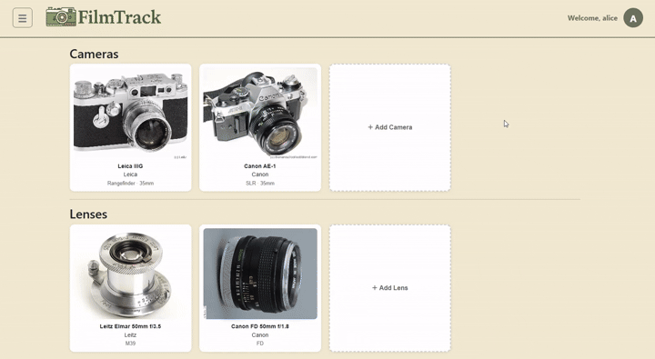
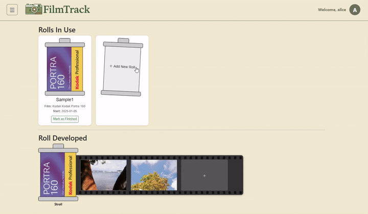
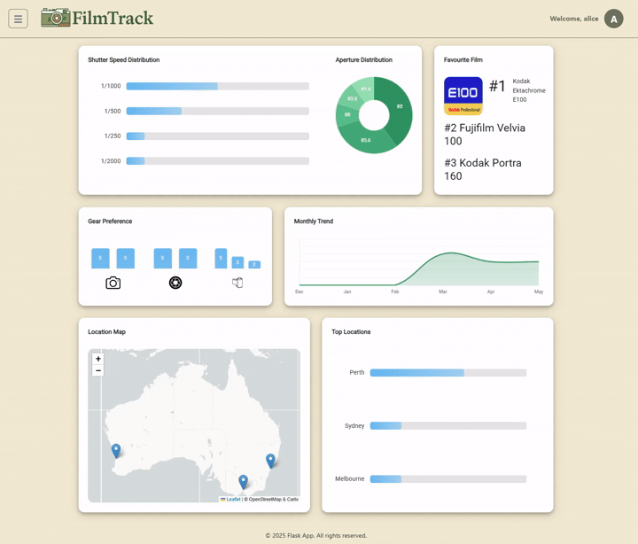
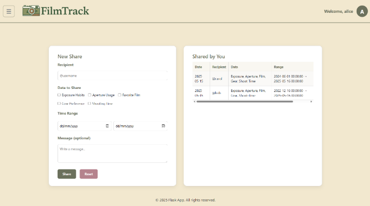
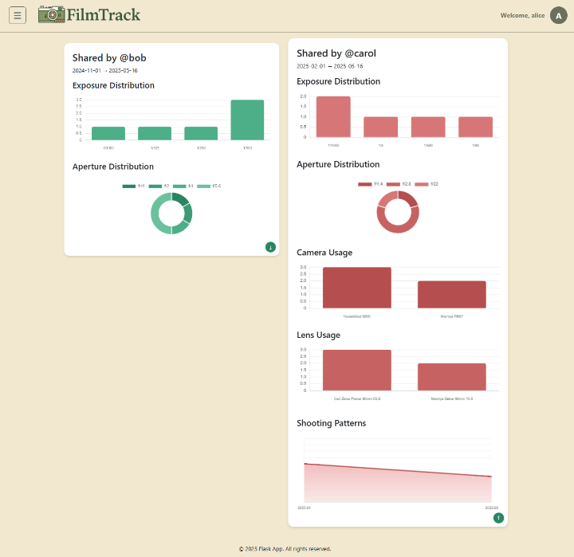

# FilmTrack - CITS3403 - G11

| Name           | Student ID | GitHub Username      |
|----------------|------------|----------------------|
| Zhanyi(Zane) Li| 24103639   | zhanzhan-lee         |
| Shining Han    | 23913741   | HSN20031118          |
| Tobias Camille | 24214277   | Resistnz             |
| Jawad Huda     | 23102177   | clashyboy1only       |


## 📌 Purpose and Design

###  1. Introduction to Film Photography Workflow

Unlike digital photography, film photography is a fully analog and manual process. A typical film shooting workflow involves:

1. **Loading the film**: A roll of film (e.g., Kodak Gold 200, 36 exposures) is loaded into a film camera.
2. **Manual settings**: The photographer selects the lens, aperture, shutter speed, and ISO (based on the film used).
3. **Shooting**: Each press of the shutter exposes a single frame — no data is automatically saved.
4. **Developing and scanning**: After finishing the roll, the film is developed and scanned to view the images.
5. **Review and analysis**: Since old film cameras don't store metadata, photographers must manually record shooting settings to review or improve their technique later.

### 2.  Motivation

To support film photography enthusiasts in efficiently logging and analyzing their shooting data, we developed **FilmTrack** — a web application that helps users digitally manage gear, log exposure data for each shot, and generate visual insights. Every shutter press can now be part of an organized and searchable digital record.


### 3.  Structure and Workflow

- **Gears Page**  
  Users can register and manage their personal gear:
  - 📷 Cameras  
  - 🔍 Lenses  
  - 🎞️ Films

- **Rolls Page**  
  Users can create new film rolls and log each shot:
  - Select a film from the registered gear
  - Choose the camera and lens used for each shot
  - Enter aperture, shutter speed, ISO, shooting time, and notes

- **Stats Page**  
  Automatically generates visual charts based on uploaded data:
  - Exposure habits (aperture, shutter speed, ISO distributions)
  - Gear usage trends (most used cameras, lenses, films)
  - Shooting time patterns (activity by day, week, or month)
  

- **Share Page**  
  Users can selectively choose which statistics to share and generate a public viewable page of their photography data.
  
- **Shared Stats Page**  
  Browse stats shared by other users.
  


The system is built around this workflow:  
**Register gear ➜ Create roll ➜ Upload photo data ➜ View statistics ➜ Share (optional)**  
providing film photographers with a complete digital solution for recording and analyzing their work.

---

## 🧰Project Setup

### 1. Prerequisites

- **Operating System**: 
    - **Recommand:** Ubuntu 24.04 (or WSL with Ubuntu 24.04)
    - Windows 11
    - MacOS
- **Python Version**: Python 3.10 or later


### 2. Step-by-step Setup Guide

#### 1️⃣ Clone the Project

Start by cloning the project repository:

```bash
git clone https://github.com/zhanzhan-lee/CITS3403-Group11-2025.git
cd CITS3403-Group11-2025
```

#### 2️⃣ Install Python and Virtual Environment Support

Make sure Python and the `python3-venv` module are installed on your machine. Run the following commands to install the necessary packages:

```bash
sudo apt update
sudo apt install python3 python3-venv python3-pip
```

#### 3️⃣ Create and Activate the Virtual Environment

Create a virtual environment to isolate project dependencies:
- **Linux / macOS / WSL:**
```bash
python3 -m venv venv
source venv/bin/activate
```
- **Windows**
```bash
python3 -m venv venv_win
.\venv_win\Scripts\activate   
```


Once activated, your terminal prompt should change to `(venv)` or `(venv_win)`.

#### 4️⃣ Install Project Dependencies

With the virtual environment activated, install the required dependencies using `requirements.txt`:

```bash
pip install -r requirements.txt
```

This will install all the necessary packages, including Flask and Flask-WTF.

#### 5️⃣ Run the Application 


```bash
flask run
```

Visit `http://127.0.0.1:5000` in your browser to see the app running.


### 3. Usage

- **Development Mode**: The application runs in development mode with auto-reloading enabled. Simply run `flask run` to start the app.

---


## 🔧 Running Tests

#### 🔹 Prerequisites
- Python 3.10+  
- All dependencies installed:

```bash
pip install -r requirements.txt
```

###  1. Unit Tests

Unit tests cover the core logic and backend functionality of the application.

#### 🔹 Run All Unit Tests

Use the following command to discover and run all unit tests:

```bash
python -m unittest discover -s tests -p "test_unit*.py"
```

#### 🔹 Run a Specific Unit Test File

Example: run only the gear-related unit tests:

```bash
python -m unittest tests.test_unit_gear
```


### 2. System Tests

System tests simulate user interactions with the UI (using Selenium) and must be run manually.

#### 🔹 Run a System Test Script

Example: test the full gear upload flow:

```bash
python tests/test_sys_photo.py
```

> 💡 **Note:** If system tests involve browser automation (Selenium), make sure:
>
> * A compatible browser (e.g., Chrome) and WebDriver are installed
> * You are running in a GUI-enabled environment (not WSL/headless)

---